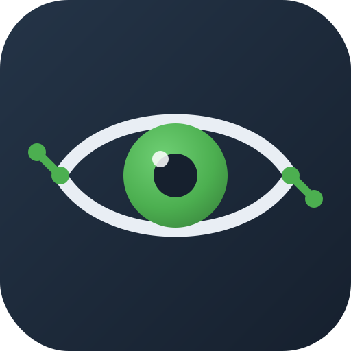
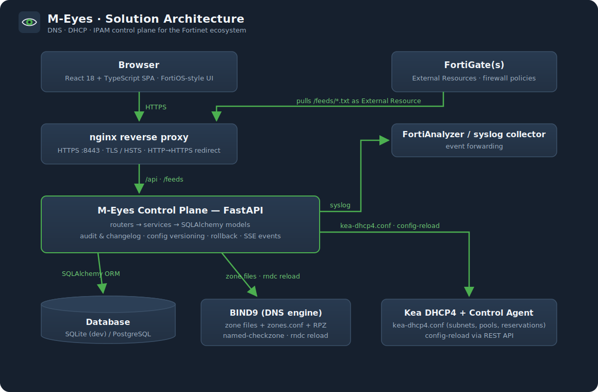

<p align="center">
  
</p>

<h1 align="center">M-Eyes</h1>

**M-Eyes** is an open-source **DDI platform** — DNS, DHCP and IP Address Management in a
single control plane — built for the **Fortinet ecosystem**, with a FortiOS-style web UI,
automatic configuration versioning and self-generating documentation.

> M-Eyes models your networks, zones and scopes, generates
> engine-native configuration for **BIND9** and **Kea DHCP**, and publishes your address
> data as feeds that **FortiGates consume natively** as External Resources.

## Features

| Area | Highlights |
|---|---|
| **IPAM** | network containers & subnets, IP inventory, next-free-IP allocation, **next-available-subnet allocation from containers**, utilization, VLAN/site metadata, tags, **network discovery** (ping sweep with conflict detection) |
| **DNS** | forward & reverse zones, **primary / secondary / forward zone roles** (zone transfer from external primaries, conditional forwarding), A/AAAA/CNAME/MX/TXT/NS/PTR/SRV, automatic PTR management, SOA serial handling, **split-horizon views** (match-clients ACLs), **DNSSEC** inline signing per zone, zone-file preview, one-click deploy to BIND9 (`named-checkzone` validated, `rndc` reload) |
| **DNS Firewall** | Infoblox-style RPZ: block / NXDOMAIN, NODATA, passthru and substitute rules per domain (subdomains included), plus **threat-intelligence feeds** — subscribe to external domain blocklists (plain or hosts-file format) with automatic re-sync; everything generated as a BIND Response Policy Zone |
| **DHCP** | scopes mapped to IPAM networks, ranges, MAC reservations (mirrored into IPAM), options, deploy to Kea via Control Agent, **live lease viewer** |
| **Hosts** | composite create: IP + A + PTR + DHCP reservation in one call — and one delete to reverse it |
| **Extensible Attributes** | typed, admin-defined metadata (string / integer / email / URL / date / enum) attachable to networks, IPs, zones, records and hosts |
| **Search** | global search across networks, IPs, zones, records, hosts and firewall rules from the top bar |
| **Fortinet** | token-protected External Resource feeds (subnets / tagged objects / blocklist / FQDNs), per-feed FortiGate CLI snippets, token rotation, syslog forwarding to FortiAnalyzer or any collector |
| **Enterprise integrations** | pluggable connectors for **FortiGate** (import interface subnets → IPAM, DHCP leases → assets), **FortiManager** (push networks as address objects), **FortiAnalyzer**, **FortiAuthenticator**, **Microsoft DNS** (AXFR import) and **Microsoft Entra ID / Intune** (device import) — test & sync per connector |
| **Asset management** | built-in **CMDB cross-referenced to DDI**: assets with interfaces linked to IPAM by MAC/IP, lifecycle/owner/location/criticality, auto-reconcile from IPAM, discovery and integrations |
| **Autonomy** | background **automation engine** — scheduled discovery sweeps, asset reconciliation, integration syncs, **drift-gated auto-deploy** and threat-feed refresh, all attributed and auditable |
| **SSO / RBAC** | enterprise **SAML 2.0 SSO** (M-Eyes as SP) with **FortiAuthenticator** as the recommended IdP, signed-assertion verification, group→role mapping and JIT provisioning; three-tier **RBAC** (admin / operator / viewer) and user management |
| **Automation API** | **API keys / service accounts** (`X-API-Key`) with optional expiry for Terraform, Ansible and scripts — every change attributed in the changelog |
| **Versioning** | immutable changelog with before/after diffs, global config version, one-click rollback, auto-generated Markdown runbook, deploy-drift display |
| **Operations** | **Command Center** — a live, futuristic overview (animated KPIs, host resource gauges, network-utilisation bars, engine nodes and an SSE event feed) — plus an operational **Dashboard** with a system-status panel (version, configurable time zone, uptime, host info, inline update check & one-click upgrade) and a **resource monitor** (CPU / memory / disk / load); event log with live tail, debug mode, engine connectivity tests, diagnostics bundle, **one-click config backup & restore**, **in-app update — check, upgrade and restart the services from the UI, no SSH** |
| **HTTPS / TLS** | HTTPS out of the box with an auto-generated self-signed cert; in-UI certificate manager — import a CA, generate a CSR, import the signed cert, activate it and hot-reload the proxy; HTTP→HTTPS redirect, HSTS and minimum-TLS-version controls |

## Architecture



The control plane never speaks DNS or DHCP itself: it renders engine-native
configuration (validated zone files for BIND9, `kea-dhcp4.conf` for Kea) and triggers
reloads over the engines' native control channels. Full details:
[docs/architecture.md](docs/architecture.md).

## Quick start (Docker)

```bash
docker compose up -d --build
```

- Web UI: **https://localhost:8443** — login `admin` / `admin`
  (HTTP on http://localhost:8080 redirects to HTTPS)
- API & Swagger: http://localhost:8000/docs
- DNS (BIND9): `dig @localhost -p 5353 ns1.corp.m-eyes.local` (after deploying from the UI)

HTTPS works out of the box: on first start M-Eyes generates a self-signed
certificate (your browser will warn until you import a CA-signed one). Manage
certificates from **System → Settings → HTTPS / TLS**: import a CA, generate a
CSR, import the signed certificate and activate it — all from the UI, no restart.
Set `MEYES_HOSTNAME` before the first start to control the certificate's CN/SAN.

Demo data is seeded automatically (`MEYES_SEED_DEMO=false` to skip).

## Upgrading

Releases publish versioned images to GHCR, and **data persists across
upgrades** — the database lives in a named volume and schema migrations run
automatically on start:

```bash
docker compose pull && docker compose up -d
```

Or update **without SSH**: **System → Settings → Backup & Updates → Software
Updates → Update now & restart** pulls the new images and restarts the services
in place, live from the browser. Pin a release with `MEYES_VERSION=x.y.z` in
`.env` for controlled upgrades; the same page exports/restores the whole
configuration as a single JSON backup. Details:
[docs/upgrade.md](docs/upgrade.md).

## Quick start (development)

```bash
# backend — http://localhost:8000
cd backend && pip install -e ".[dev]" && python -m app.scripts.seed && uvicorn app.main:app --reload

# frontend — http://localhost:5173
cd frontend && npm install && npm run dev

# tests
cd backend && pytest
```

No Docker needed: without the engines M-Eyes runs in management-only mode — config
generation and previews work; deploys report `unreachable`.

## FortiGate integration in 30 seconds

1. Open **Security Fabric → Fortinet Feeds**, copy the CLI snippet of a feed:

```text
config system external-resource
    edit "meyes-networks"
        set type address
        set resource "https://meyes.example.com/feeds/networks.txt"
        set username "feed"
        set password <token>
        set refresh-rate 5
        set status enable
    next
end
```

2. Use the external address object in firewall policies. Blocklist additions in M-Eyes
   propagate to every FortiGate on its next refresh.

Full guide: [docs/fortinet-integration.md](docs/fortinet-integration.md)

## Enterprise

M-Eyes is built for the enterprise edge of the Fortinet + Microsoft world:

- **SAML Single Sign-On** — M-Eyes is a SAML 2.0 Service Provider. Wire it to
  **FortiAuthenticator** (recommended), Microsoft Entra ID, Okta or any IdP;
  assertions are signature-verified and IdP groups map to M-Eyes roles. Easy
  config with advanced options, step-by-step IdP walkthrough:
  [docs/saml-sso.md](docs/saml-sso.md).
- **Integrations** — one-click connectors for FortiGate, FortiManager,
  FortiAnalyzer, FortiAuthenticator, Microsoft DNS and Microsoft Entra ID/Intune:
  [docs/integrations.md](docs/integrations.md).
- **Asset management** — a CMDB cross-referenced to your DDI data:
  [docs/asset-management.md](docs/asset-management.md).
- **Autonomy** — scheduled, drift-gated automation:
  [docs/automation.md](docs/automation.md).

## Repository layout

```
backend/    FastAPI control plane (models, services, generators, tests)
frontend/   React + TypeScript SPA, FortiOS-style theme
deploy/     Dockerfiles, nginx, BIND9 + Kea engine assets
docs/       MkDocs documentation (auto-deployed, auto-generated API reference)
```

## Versioning

- **Configuration**: every change is recorded with a before/after diff and a global config
  version; anything can be rolled back from the Change Log page.
- **Software**: releases are fully automated with semantic-release — conventional commits
  on `main` produce the changelog, version bumps, tags and GitHub Releases.

## Production checklist

- Replace the auto-generated self-signed certificate: in **System → Settings →
  HTTPS / TLS** generate a CSR, have it signed by your CA, import it and activate
  it (or import an existing cert + key). Enable HSTS once HTTPS is confirmed.
- Set `MEYES_HOSTNAME` to the FQDN clients use so the bootstrap certificate and
  CSR defaults match.
- Set `MEYES_JWT_SECRET`; change the admin password.
- Regenerate `deploy/bind9/rndc.key` (`rndc-confgen -a`) — the committed key is dev-only.
- Give the Kea container L2 access (`network_mode: host`) for real DHCP service.

## License

MIT
