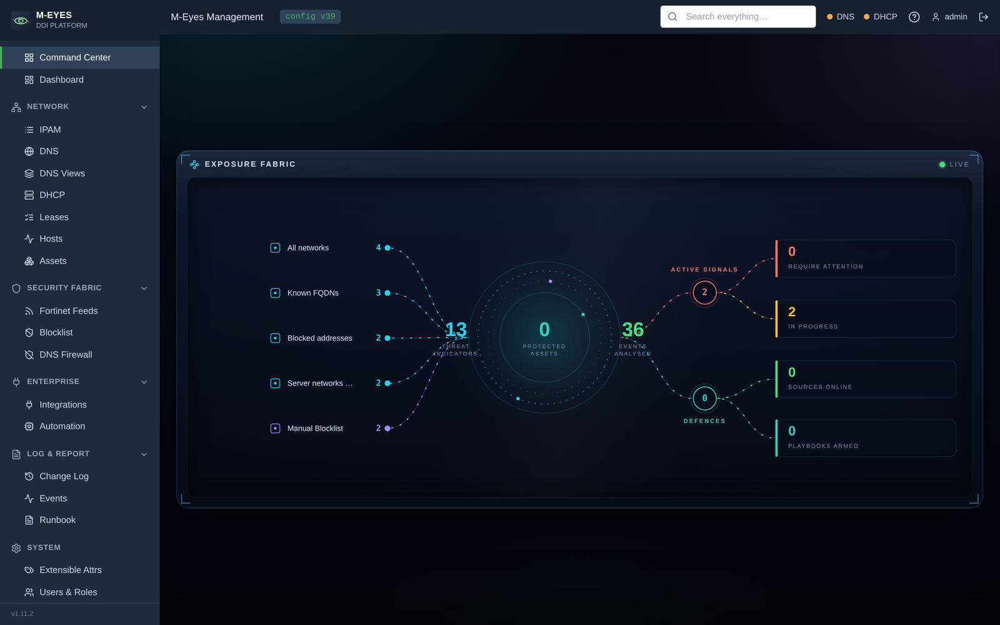

# M-Eyes

**M-Eyes** is an open-source DDI platform — DNS, DHCP and IP Address Management in one
control plane — with first-class Fortinet ecosystem integration and a FortiOS-style UI.

More views in the [screenshot gallery](screenshots.md).

## What it does

- **IPAM** — network hierarchy (containers / subnets), IP inventory with statuses,
  next-free-IP allocation, utilization tracking, tags.
- **DNS** — authoritative forward and reverse zones, all common record types, automatic
  PTR management, SOA serial handling, deployment to **BIND9**.
- **DHCP** — scopes mapped 1:1 to IPAM networks, address ranges, MAC reservations
  (mirrored into IPAM), options, deployment to **Kea DHCPv4**.
- **Hosts** — Infoblox-style composite objects: one create call allocates the IP, writes
  the A and PTR records and optionally a DHCP reservation.
- **Fortinet feeds** — token-protected HTTP feeds that FortiGates consume natively as
  External Resources: subnets, tagged objects, a blocklist and an FQDN feed.
- **Automatic config versioning** — every change is recorded with a before/after diff,
  a global config version, one-click rollback, and an auto-generated Markdown runbook.
- **Operational logging** — event log with severities and categories, optional syslog
  forwarding (UDP/TCP), live dashboards via Server-Sent Events, debug diagnostics.

## Architecture at a glance

M-Eyes is the management plane. It renders engine-native configuration (BIND zone files,
Kea JSON) and reloads the engines over their native control channels (`rndc`, Kea Control
Agent). When the engines are not running, M-Eyes keeps working in management-only mode:
configs are still generated and written; deploys report `unreachable`.

See [Architecture](architecture.md) for details.
