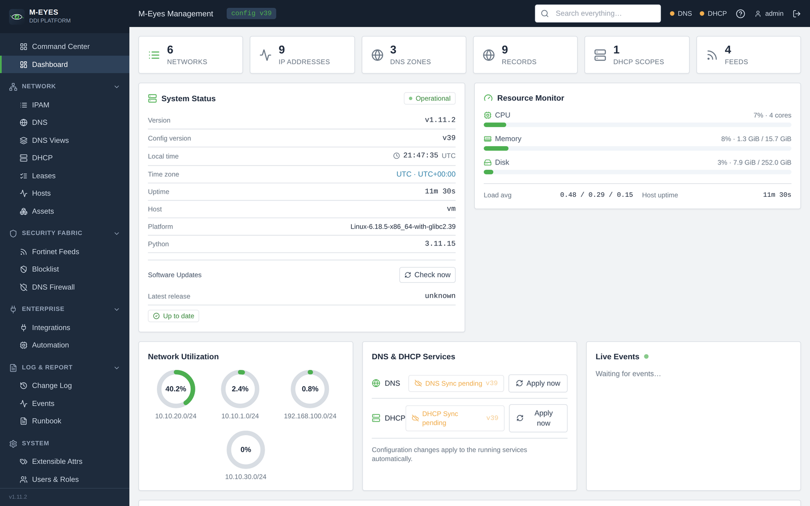
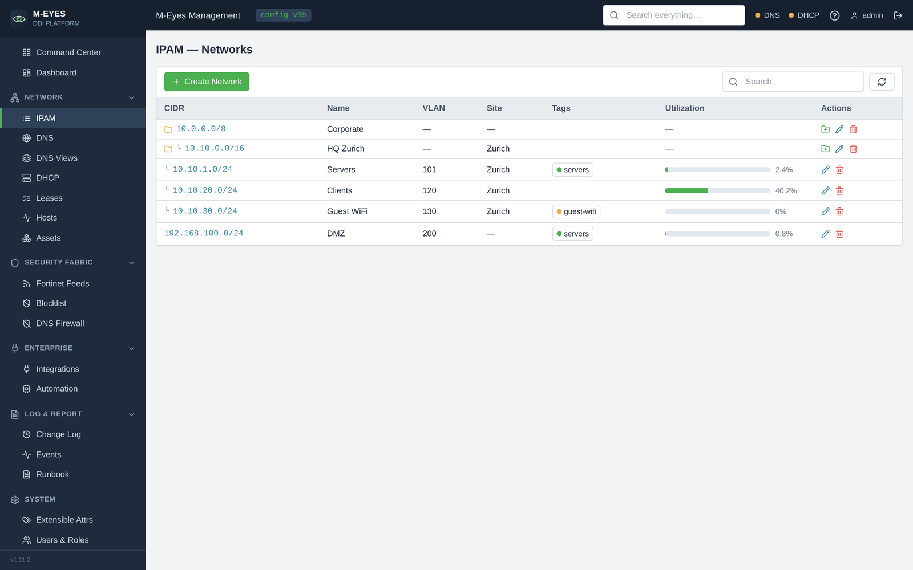
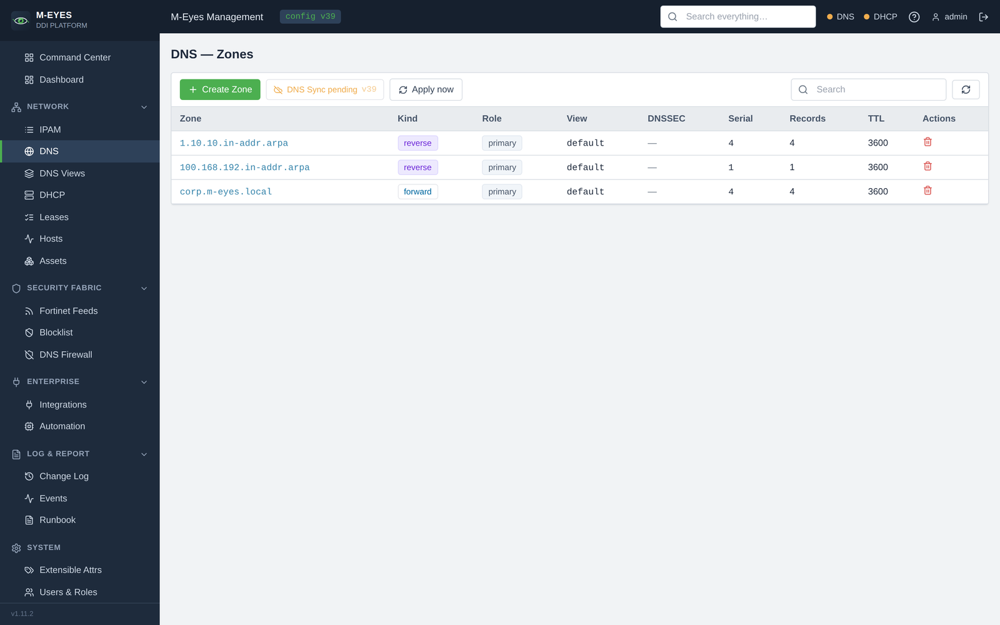
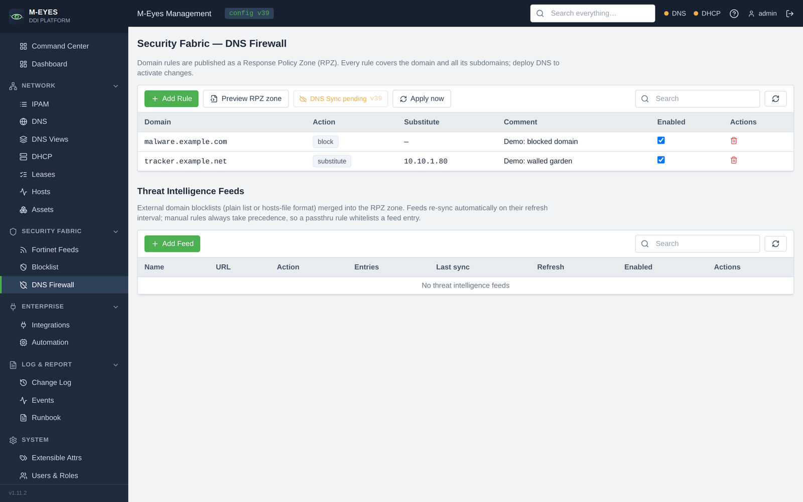
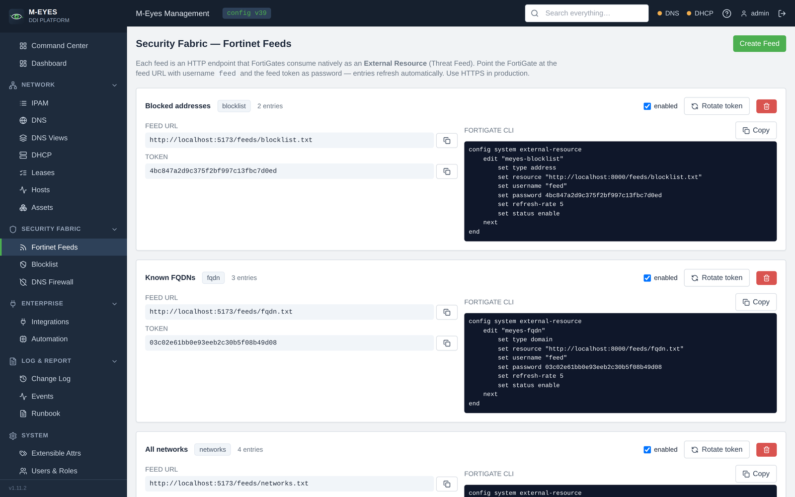
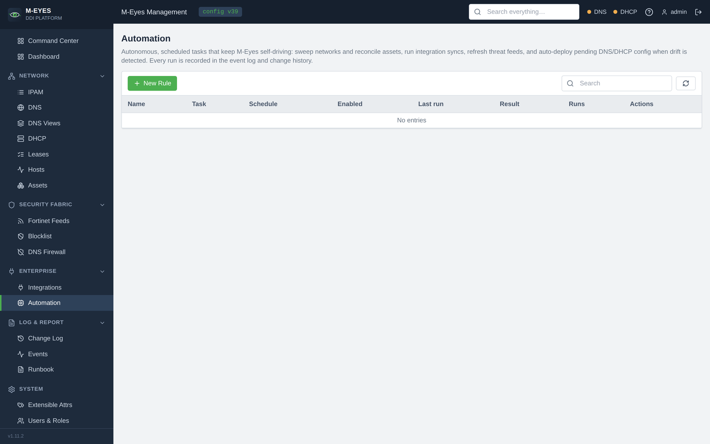
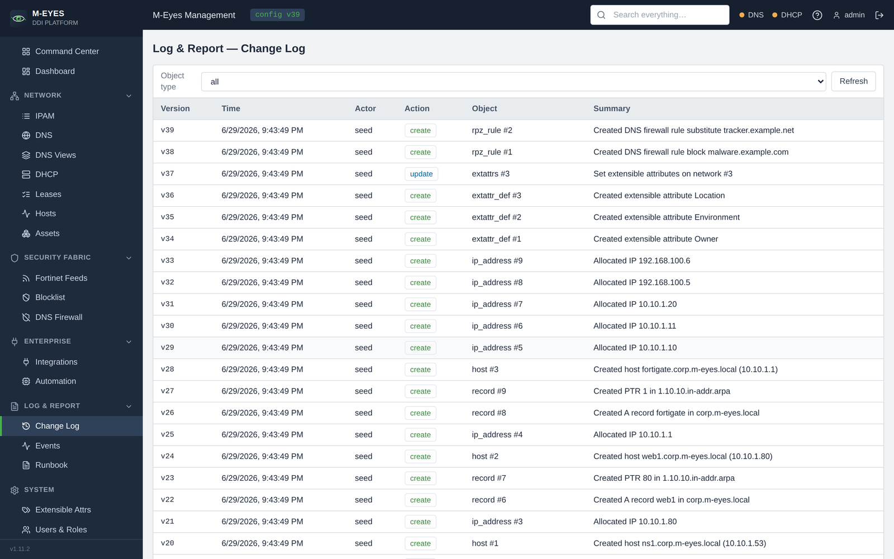

# Screenshots

A tour of the M-Eyes web UI. The screenshots use the bundled demo data
(`MEYES_SEED_DEMO=true`).

## Command Center

A live, full-bleed SOC surface: the security **exposure fabric** wires intel
sources through the protected estate to active signals and standing defences.

## Operational dashboard

KPIs, system status with an inline update check, a host resource monitor,
network-utilisation donuts, engine sync state and a live event stream.

## IPAM

The network hierarchy — containers and subnets with VLAN/site metadata, tags
and live utilisation bars.

## DNS

Authoritative forward and reverse zones with all common record types and
automatic PTR management.

## DHCP

Scopes mapped 1:1 to IPAM networks, with ranges, options and MAC reservations.

## DNS Firewall

Infoblox-style Response Policy Zone rules plus subscribable threat-intelligence
feeds, all rendered into a single BIND RPZ.

## Fortinet feeds

Token-protected External Resource feeds — subnets, tagged objects, blocklist and
FQDNs — each with a ready-to-paste FortiGate CLI snippet.

## Asset management

A built-in CMDB cross-referenced to your DDI data: assets and interfaces linked
to IPAM by MAC/IP, with lifecycle, owner, location and criticality.

## Automation & autonomy

The background automation engine — scheduled discovery sweeps, reconciliation,
integration syncs, drift-gated auto-deploy and threat-feed refresh.

## Change Log

An immutable, auditable history of every configuration change with before/after
diffs, a global config version and one-click rollback.

